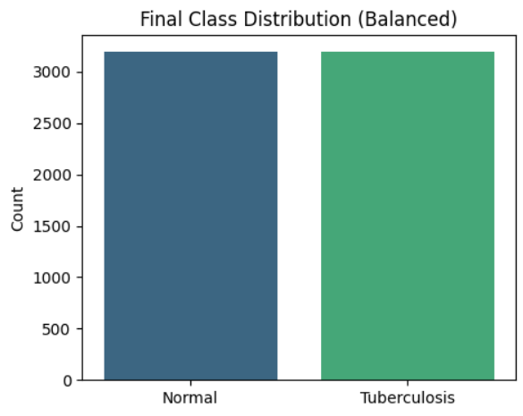
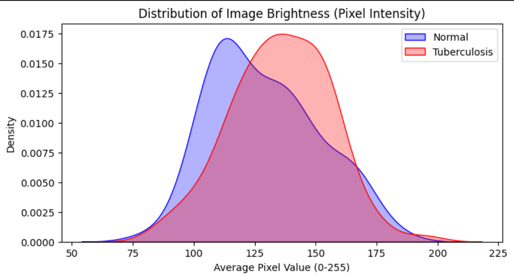
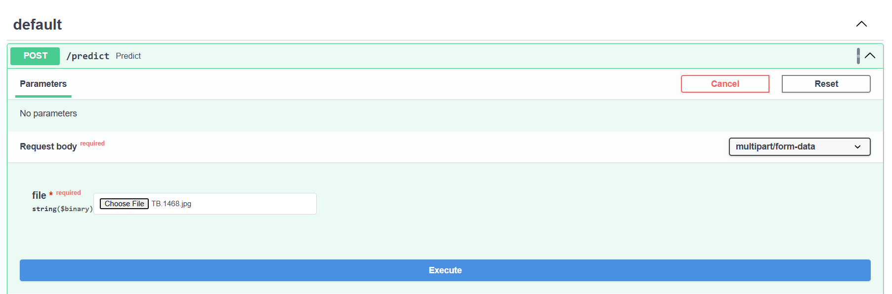
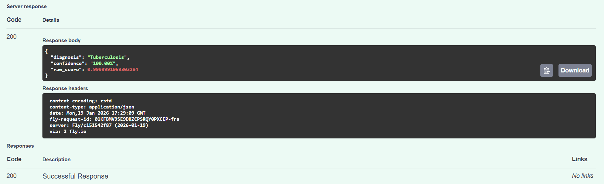

# Tuberculosis Detection from Chest X-Ray Images

> **Disclaimer:** This model is for **educational purposes only**. It is not intended for clinical diagnosis, medical decision-making, or as a substitute for professional medical advice.

## Problem Description
Tuberculosis (TB) remains one of the world's top infectious killers, causing 1.3 million deaths in 2022 alone. While it is curable, early detection is critical.

The gold standard for screening—Chest X-Rays (CXR)—requires expert radiologists to interpret. In many developing regions, there is a shortage of skilled experts, leading to delayed diagnoses.

**The Goal:** Build a lightweight, deployable Deep Learning model capable of classifying chest X-rays as "Normal" or "Tuberculosis" to assist in automated screening.

---

## Dataset
To ensure model robustness two different datasets were combined:

* Primary Source: [Tuberculosis (TB) Chest X-ray Database](https://www.kaggle.com/datasets/tawsifurrahman/tuberculosis-tb-chest-xray-dataset) (Kaggle)
* Secondary Source: [Tuberculosis Chest X-rays](https://data.mendeley.com/datasets/8j2g3csprk/2) (Mendeley Data)

**Final Dataset:**
After cleaning and merging, the dataset was strictly balanced to prevent class bias.

Total Images: ~6,400 (Balanced 50/50 between Normal and TB)

---

## Exploratory Data Analysis

### 1. Class Distribution
We enforced a strict balance between classes. Imbalanced medical datasets often lead to models that simply guess "Healthy" to achieve high accuracy. By undersampling the majority class ("Normal"), we ensured the model treats TB detection with equal priority.



### 2. Brightness Analysis
An analysis of pixel intensity revealed a distinct pattern:
* **Observation:** Tuberculosis images tend to have a higher average pixel intensity (brighter) compared to Normal lungs.
* **Medical Explanation:** Healthy lungs are filled with air, which appears black on X-rays. TB causes consolidation (fluid/pus) and scarring (fibrosis), which are denser and appear white/bright.



### 3. Data Quality Assessment
During EDA, we discovered a potential **"Shortcut Learning"** risk.
* The "Normal" images from the Mendeley dataset had a significantly different contrast profile compared to the Kaggle dataset.
* **Risk:** A naive model might learn to classify the *source* of the image (e.g., "Dark image = Normal", "Bright image = TB") rather than the disease itself.
* **Action:** We introduced augmentation (RandomBrightness, RandomContrast) and mixed the sources to force the model to focus on structural lung features rather than global image statistics.

### 4. Sample X-Rays
Below are samples from the processed dataset showing the visual difference between healthy lungs and those affected by Tuberculosis.


### 5. Preprocessing Pipeline
To prepare the raw X-rays for the MobileNetV2 architecture, we applied the following transformations:
1.  **Resize:** All images scaled to `224x224` pixels.
2.  **Channel Check:** Converted all grayscale images to RGB (3 channels) as required by the pre-trained weights.
3.  **Scaling:** Pixel values normalized to `[-1, 1]` range to match the ImageNet pre-training distribution.

---

## Training Results

### Model Architecture Comparison
We experimented with two architectures based on **Transfer Learning (MobileNetV2)**.

| Component | Baseline model | Enhanced model  |
| :--- | :--- | :--- |
| **Base Model** | MobileNetV2 (Frozen) | MobileNetV2 (Frozen) |
| **Custom Head** | GlobalAvgPooling -> Dense(1) | **Conv2D** -> GlobalAvgPooling -> **Dense(64)** -> Output |
| **Augmentation** | Basic Flip/Rotation | Heavy Flip/Rotation/Zoom |
| **Dropout** | 0.2 | 0.5  |
| **Result** | Fast, but lower Recall | Higher Accuracy & Stability |

**Why the Enhanced model was better:**
The frozen MobileNetV2 detects generic shapes (lines, curves). Adding a trainable **Conv2D** layer before pooling allowed the model to combine these generic shapes into "TB-specific" textures (like cloudiness in the upper lobes) before making a decision.

### Final Metrics (Enhanced model)
* **Validation Accuracy:** **93.6%**
* **Validation Recall:** **87.3%** (High recall is crucial for minimizing false negatives)
* **Loss:** Stabilized around 0.30

The model was trained for 15 epochs using an **Adaptive Learning Rate (ReduceLROnPlateau)**, which automatically reduced the learning rate when validation accuracy plateaued.


---

## Installation & Setup
### Prerequisites
Make sure you have installed:
* Python 3.11+
* uv package manager
---
### Setup
Clone the repository and install dependencies.

```bash
# Clone the repository
git clone https://github.com/alexanderfrombrest/tuberculosis-detection.git
cd tuberculosis-detection

# Install dependencies
uv sync
```
---

### Usage

#### Train the Model
You can retrain the model from scratch on your local machine. 
The script will automatically download the datasets from Kaggle, process them, and start training.

```bash
# Run the training script
uv run train.py
```

**Output:** The trained model will be saved to models/tb_model.keras.

#### Run the API Locally

Start the FastAPI server to test predictions locally.

```bash
uv run uvicorn predict:app --host 0.0.0.0 --port 8000 --reload
```

Once running, open your browser to http://localhost:8000/docs to use the interactive Swagger UI.

---

## Cloud deployment (Fly.io)

The project is configured for easy deployment to Fly.io using Docker.
If using for first time, Fly.io might ask you to sing up.

### Deploy

```bash
# Initialize the app
fly launch

fly deploy
```

Once deployed, Fly.io will provide a public URL. 

1. Navigate to https://[YOUR-APP-URL]/docs.
2. Select the /predict endpoint.
3. Upload a chest X-ray image and click Execute.



